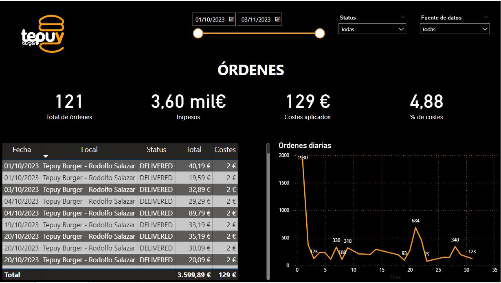
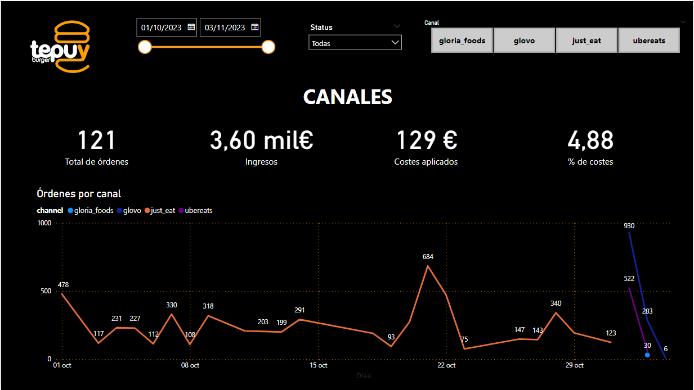

  

# Dashboard - Tepuy Burger

## **About Tepuy Burger**
Tepuy Burger is a hamburger chain created in 2017. After an organic and constant growth based on the quality of their burgers, today it has 3 restaurants in Alicante & Benidorm, and expects to extend their business in the next months.

## **Software Issues**
Based in their not expected growth, this enterprise today manages its business with several softwares that have nothing to do with each other.

The ones that are relevant to the current project are the following:

- Otter – To manage delivery services for three of the delivery apps.
- Deliverect – To manage delivery services for one of the delivery apps. It came after Otter, so they repeat some of the information.

## **ETL**
Data extraction, transformation and loading was done through web scraping and data extracted from the software in a csv file.

- Otter:
Provides data from the following delivery channels:
    - GloriaFood (Orders from their own website).
    - Glovo
    - Uber eats

- Deliverect:
Provides data only on Just Eat deliveries.

Data loading was done in a MySQL database on Workbench.

For more details:

  - Related repo: [ETL_Project](https://github.com/jomariapc/ETL_Project)

## **Dashboard**

### **Business needs**
Synchronizing the delivery of orders (orders) in a single dashboard has not been possible due to the fact that the information is located in the platforms described above. 

Therefore, in this project we have created a scorecard with the following KPIs and related charts:

### **ORDERS**

  

Initially the customer needs order information (orders), with "conversion funnel" KPIs at the top of the list.

#### *__FILTERS:__*
**1. Date** 

**2. Order status:**
- ACCEPTED
- CANCELED
- DELIVERED
- NEW

**3. Software:**
- Deliverect
- Otter

####  *__KPIs:__*
1. Total orders
2. Total revenue from orders
3. Total cost applied to orders
4. Percentage of costs over revenues (calculated field)

#### *__CHARTS:__*

**1. Order details information**  
- Date (calculated column without time)
- Location from which the order was placed
- Order status 
- Total paid by customer
- Associated costs

**2. Line chart**
- Evolution of the order quantity over time

### **CHANNEL**

  

As a next step, the customer needs to evaluate the information for each of the channels, so that he can see at a glance, how each one works.

#### *__FILTERS:__*
**1. Date** 

**2. Order status:**
- ACCEPTED
- CANCELED
- DELIVERED
- NEW

**3. Channel:**
- Gloria Foods
- Glovo
- Just Eat
- Ubereats

####  *__KPIs:__*
1. Total orders
2. Total revenue from orders
3. Total cost applied to orders
4. Percentage of costs over revenues (calculated field)

#### *__CHARTS:__*

  **2. Line chart**
  
  Evolution of orders per channel. In this graph, the customer can see which of them performs best at a glance.

*_IMPORTANT:_* the data is not updated in real time, so the values will not be as revealing of order behavior and delivery channels.

#### **NEXT STEPS **

Integration through API of the other systems used by the company:

- Gloria foods – Restaurant order system
- Tipsi – TPV system to manage orders
- Cover manager – Software to manage table reservations
- Mapal reputation – To manage delivery and eat in reviews.
